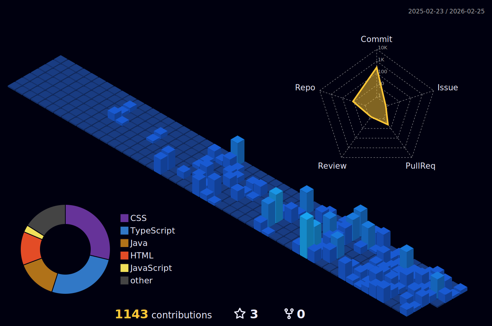

<h1 align="center">
  
</h1>

  <strong>Um entusiasta de tecnologia em transição de carreira para o mundo do desenvolvimento de software.</strong>

  <a href="#-sobre-mim">Sobre Mim</a> •
  <a href="#-stack-de-tecnologias">Tecnologias</a> •
  <a href="#-projetos-recentes">Projetos</a> •
  <a href="#-conecte-se-comigo">Contato</a>

---

### 📊 Minhas Estatísticas no GitHub

<table width=100%>
<tr>

   <td width=33,33333333333333% valign=center>
   
   </td>
   <td width=33,33333333333333% valign=center>

   </td>
   <td width=33,33333333333333% valign=center>
   
   </td>
</tr>

</table>

### 👨‍💻 Sobre Mim

<table width="95%">
  <tr>
    <td width="60%" valign="middle">
      <h3 align="center">👨‍💻 Sobre Mim</h3>
      
Meu nome é Carlos, mas pode me chamar de <strong>Kadu</strong>. Sou um profissional com 8 anos de experiência sólida em redes de internet, e atualmente estou em uma jornada de transição de carreira, mergulhando de cabeça nos estudos para me tornar um <strong>Desenvolvedor Full Stack</strong>.

      <ul>
          <li>🌱 Atualmente, estou focando em aprimorar minhas habilidades em <strong>JavaScript, TypeScript e Java</strong>.</li>
          <li>🚀 Busco oportunidades para colaborar em projetos e transformar ideias em código funcional.</li>
          <li>💬 Fique à vontade para entrar em contato para trocarmos ideias sobre tecnologia ou para futuras colaborações.</li>
      </ul>
    </td>
    <td width="40%" valign="middle">
      <h3 align="center">💻 Stack Principal</h3>
      

        
      

    </td>
  </tr>
</table>

 

---

### 🚀 Projetos em Destaque

<table align="center">
  <tr align="center" valign="top">
    <td width="50%">
      <h3 align="center">Gerenciador de Prompts</h3>
      
      

        <a href="https://prompts.kadudev.com/">
          <strong>Acesse a demonstração ➔</strong>
        </a>
      

      
Uma aplicação web para criar, salvar e gerenciar prompts de forma eficiente, construída com HTML, CSS e JavaScript puro.

    </td>
    <td width="50%">
      <h3 align="center">MyFlix</h3>
      
      

        <a href="https://myflix.kadudev.com/">
          <strong>Acesse a demonstração ➔</strong>
        </a>
      

      
Um agregador de links simples que serve como um cartão de visitas virtual, com seletor de tema claro/escuro. Desenvolvido no curso Discover da Rocketseat.

    </td>
  </tr>
</table>

---

### 🎨 Minhas Contribuições

  

  

---

<h3 align="center">📬 Entre em Contato</h3>

  
  
  

