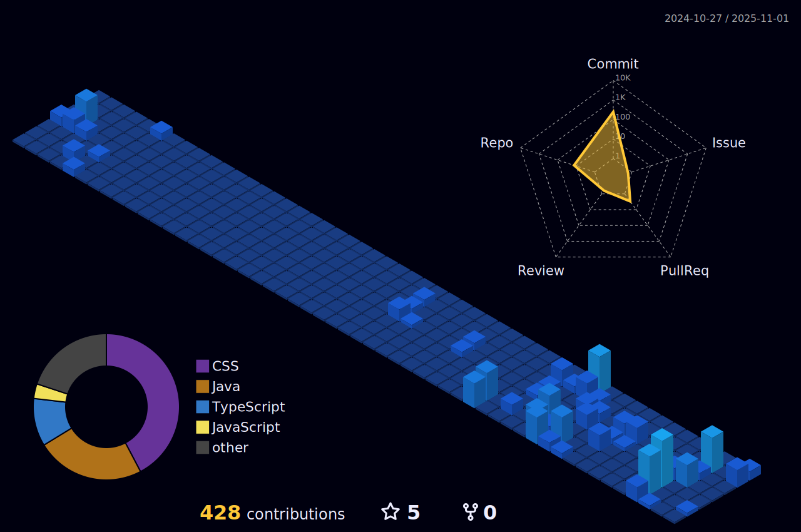

<h1 align="center">
  
</h1>

  <strong>Um entusiasta de tecnologia em transição de carreira para o desenvolvimento de software.</strong>

  

  <a href="#-sobre-mim">Sobre Mim</a> •
  <a href="#-stack-de-tecnologias">Tecnologias</a> •
  <a href="#-projetos-em-destaque">Projetos</a> •
  <a href="#-conecte-se-comigo">Contato</a>

---

### 📊 Minhas Estatísticas no GitHub

<table width="100%" align="center">
  <tr>
    <td width="50%" valign="center" align="center">
      
    </td>
    <td width="50%" valign="center" align="center">
      
    </td>
  </tr>
</table>

---

### 👨‍💻 Sobre Mim

Meu nome é Carlos, mas pode me chamar de <strong>Kadu</strong>. Tenho cerca de 8 anos de experiência com redes de internet e infraestrutura, e atualmente estou em transição de carreira para atuar como <strong>Desenvolvedor Full Stack</strong>.

- 🌱 No momento, estou focado em aprimorar minhas habilidades em <strong>JavaScript, TypeScript e Java</strong>.
- 🧠 Tenho bagagem em lógica, redes, sistemas e troubleshooting, o que me ajuda bastante no raciocínio de desenvolvimento.
- 🚀 Busco oportunidades para colaborar em projetos reais, evoluir como desenvolvedor e transformar ideias em código funcional.
- 💬 Gosto de trocar ideia sobre tecnologia, carreira e boas práticas de desenvolvimento.

---

### 💻 Stack de Tecnologias

  

---

### 🚀 Projetos em Destaque

<table align="center">
  <tr align="top">
    <td width="50%">
      <h3 align="center">Gerenciador de Prompts</h3>
      
      

        <a href="https://prompts.kadudev.com/">
          <strong>Acesse a demonstração ➔</strong>
        </a>
      

      

        Aplicação web para criar, salvar e gerenciar prompts de forma organizada.
        Desenvolvida com <strong>HTML, CSS e JavaScript puro</strong>, com foco em usabilidade e produtividade.
      

    </td>

    <td width="50%">
      <h3 align="center">MyFlix</h3>
      
      

        <a href="https://myflix.kadudev.com/">
          <strong>Acesse a demonstração ➔</strong>
        </a>
      

      

        Um agregador de links que funciona como um cartão de visitas virtual, com seletor de tema claro/escuro.
        Projeto desenvolvido no curso <strong>Discover</strong> da Rocketseat, utilizando <strong>HTML, CSS e JavaScript</strong>.
      

    </td>
  </tr>
</table>

---

### 🎨 Minhas Contribuições

  

  

---

<h3 align="center" id="-conecte-se-comigo">📬 Entre em Contato</h3>

  
  
  

